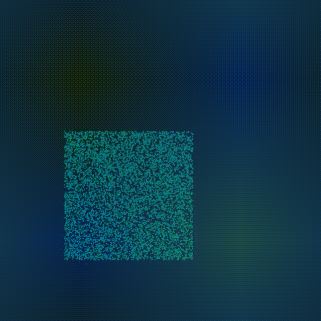
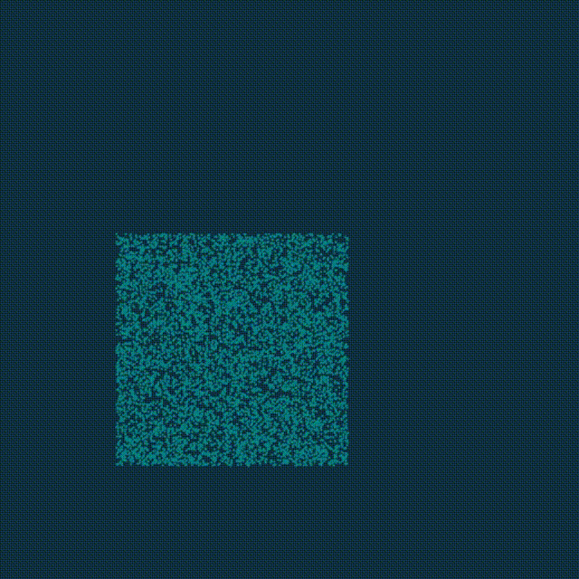

# mpm88.py 与各种扩展

## 原版原理讲解

效果：



- 程序中

- Clear Grid

  清空网格上的物理量

  ```python
  for i, j in grid_m:
          grid_v[i, j] = [0, 0]
          grid_m[i, j] = 0
  ```

- P2G

  P2G中包含将物理参数从粒子上传输至网格上，并进行这个过程中计算压力的影响。

  需要传输的物理参数包括质量与动量。

  ```python
  for p in x:
      Xp = x[p] / dx								#将坐标转换为网格单位
      base = int(Xp - 0.5)							#计算粒子左下方网格坐标，因为网格偏移为0，1，2，与左下方网格坐标相加后即可得到周围3*3网格
      fx = Xp - base								#计算坐标相对网格偏移
      w = [0.5 * (1.5 - fx)**2, 0.75 - (fx - 1)**2, 0.5 * (fx - 0.5)**2]		#计算权重
      stress = -dt * 4 * E * p_vol * (J[p] - 1) / dx**2				#计算压力造成的affine动量
      affine = ti.Matrix([[stress, 0], [0, stress]]) + p_mass * C[p]		#压力与affine动量
      for i, j in ti.static(ti.ndrange(3, 3)):					#将粒子信息传输至周围3*3的网格
          offset = ti.Vector([i, j])						#网格偏移
          dpos = (offset - fx) * dx						#网格相对粒子坐标
          weight = w[i].x * w[j].y						#网格权重
          grid_v[base + offset] += weight * (p_mass * v[p] + affine @ dpos)	#将动量投影至网格
          grid_m[base + offset] += weight * p_mass				#将质量投影至网格
  ```

  

- Grid

  在这个过程中计算需要在grid上处理的操作，包括通过动量计算速度，施加重力与边界条件处理。

  ```python
  for i, j in grid_m:
          if grid_m[i, j] > 0:
              grid_v[i, j] /= grid_m[i, j]	#通过动量计算速度
          grid_v[i, j].y -= dt * gravity	#施加重力
          #可分离边界条件
          if i < bound and grid_v[i, j].x < 0:
              grid_v[i, j].x = 0
          if i > n_grid - bound and grid_v[i, j].x > 0:
              grid_v[i, j].x = 0
          if j < bound and grid_v[i, j].y < 0:
              grid_v[i, j].y = 0
          if j > n_grid - bound and grid_v[i, j].y > 0:
              grid_v[i, j].y = 0
  ```

  

- G2P

  在这个过程中完成将网格上的参数收集回粒子，并完成粒子参数的更新。

  收集的参数包括：C仿射速度，v速度

  更新的参数包括：x位置，J粒子体积
  
  ```python
  for p in x:
          Xp = x[p] / dx								#与p2g相同
          base = int(Xp - 0.5)							#与p2g相同
          fx = Xp - base								#与p2g相同
          w = [0.5 * (1.5 - fx)**2, 0.75 - (fx - 1)**2, 0.5 * (fx - 0.5)**2]	#与p2g相同
          new_v = ti.Vector.zero(float, 2)					#定义新的速度，用来从网格收集
          new_C = ti.Matrix.zero(float, 2, 2)					#定义新的仿射速度，用来从网格收集
          for i, j in ti.static(ti.ndrange(3, 3)):				#遍历周围3*3所有网格
              offset = ti.Vector([i, j])						#网格偏移
              dpos = (offset - fx) * dx						#网格相对粒子位置
              weight = w[i].x * w[j].y						#网格权重
              g_v = grid_v[base + offset]						#获取网格速度
              new_v += weight * g_v						#将网格速度传输至粒子
              new_C += 4 * weight * g_v.outer_product(dpos) / dx**2		#将网格仿射速度传输至粒子
          v[p] = new_v								#更新粒子速度
          x[p] += dt * v[p]							#更新粒子位置
          J[p] *= 1 + dt * new_C.trace()						#更新粒子体积
          C[p] = new_C								#更新粒子仿射速度
  ```
  
  通过以上这些部分即可求解无粘的自由面弱可压缩液体，我们可以看到比较真实的液体滴落效果
  
  ### 应力矩阵
  
  对于流体，与固体，其应力需要写为矩阵形式，在2维中为2 * 2矩阵，3维中为3 * 3矩阵对应了每个方向切面上的力矢量：
  $$
  σ_{ij}=\lim_{A\to 0} \frac{ΔF_j}{ΔA_i}
  $$
  在流体（液体或者气体）中，压力（pressure）通常是其中最重要的力，而该力方向总是与切面方向相同，因此压力部分的应力矩阵形式很简单，如下为3维，二维形式：
  $$
  σ_p=\begin{pmatrix}
  p&0&0\\
  0&p&0\\
  0&0&p\\
  \end{pmatrix}
  $$
  在mpm88的p2g过程中可以看到该计算。
  
  关于应力矩阵带来的affine动量为什么是：
  
  $$
  affine +=\sigma*4*\Delta t/dx^2
  $$
  
  大家可以在胡老师的mls-mpm文章中看到：
  
  [A Moving Least Squares Material Point Method with Displacement Discontinuity and Two-Way Rigid Body Coupling | Yuanming Hu (taichi.graphics)](https://yuanming.taichi.graphics/publication/2018-mlsmpm/)

## 粘性

效果：



根据N-S方程：
$$
ρ\frac{D\vec v}{Dt}=-\nabla P+\nabla\cdot[μ(\nabla \vec v+(\nabla \vec v)^T-\frac{2}{3}(\nabla\cdot \vec v)I)]+\nabla \cdot[ζ(\nabla\cdot \vec v)]+ρ\vec g
$$

其中，等式左端为动量变化率，等式右端依次为
$$
压力项：-\nabla P，剪切粘性项：\nabla\cdot[μ(\nabla \vec v+(\nabla \vec v)^T-\frac{2}{3}(\nabla\cdot \vec v)I)]，体积粘性项：\nabla \cdot[ζ(\nabla\cdot \vec v)]，重力项ρ\vec g
$$
对于mpm，重力项在grid上处理，弱可压缩流体计算粘性时可以忽略速度散度，因此在p2g过程中仅需要考虑粘性项与压力项，粘性应力矩阵可简化为：
$$
μ(\nabla \vec v+(\nabla \vec v)^T)
$$
考虑到mpm中C为速度梯度的近似，因此

### p2g时affine动量的计算

```python
	mu = 0.1  					#粘度
        stressMu = -(C[p] + C[p].transpose()) * mu  	#粘性应力矩阵
        stressMu *= dt * p_vol * 4 / dx**2
        affine = ti.Matrix([[stress, 0], [0, stress]
                            ]) + p_mass * C[p] + stressMu
```

为了保证收敛，需要将时间步长适当调小，从2e-4调整至1e-4：

```python
dt = 1e-4
```

即可完成粘性的添加。

## 等温气体

效果：


气体通常满足理想气体状态方程：
$$
p=ρRT
$$
其中p为压力单位Pa，ρ为密度单位为kg/m3，T为热力学温度，单位为K（开尔文），R为气体常数，对空气约为287J/kg。

对于可压缩气体，其密度不再是常数，而是会有较大幅度的变化，因此，其压力计算中不应再采用固定的粒子体积，而是采用粒子质量除以粒子密度得到粒子体积。

因此其一个时间步内的affine动量计算可以写为：
$$
\mathbf{I}_D\cdot ρ_p\cdot R\cdot T_p\cdot \Delta t \cdot 4\cdot \frac{p_{mass}}{ρ_p}/\Delta x^2=\mathbf{I}_D\cdot R\cdot T_p\cdot \Delta t\cdot 4\cdot p_{mass}/\Delta x^2
$$

### 在p2g中

```
	stress = p_mass * RT * dt * 4 / dx**2
        affine = ti.Matrix([[stress, 0], [0, stress]]) + p_mass * C[p]
```

为了简化计算可以假设温度为常数，通常在压力变化不太大的情况下，这是符合假设的。而且不需要求解能量方程。此外，等温气体的声速为：
$$
c=\sqrt{\frac{dp}{dρ}}=\sqrt{RT}
$$
通常对于流速小于0.3倍声速即Mach=v/c<0.3时，流体的密度变化范围小于5%，此时弱可压缩可以近似不可压缩。

可以看到气体膨胀并产生冲击波，但随着冲击波反射，气体逐渐趋于稳定，并填满整个空间。

## 两相流

效果：


在两相流模拟中，可以定义一个粒子类型type_p，每个粒子存储一个粒子类型，为0则为气体，为1则为液体。为了保证粒子分布均匀，先进行一段时间的气体模拟，然后将对应部分的粒子更改为液体粒子进行计算。

粒子的质量取决于类型，对于我们生活中常见的空气与水来说，密度分别为1.3kg/m3与1000kg/m3密度相差大约770倍，如果压力计算方法与气体相同，则水中声速下降为：
$$
c_{water}=c_{air}(\frac{\rho_{water}}{\rho_{air}})^{-0.5}
$$
为了加快求解速度，以及增强不可压缩性，可以令液体的声速与气体相同，在液体中额外计算体积变化导致的压力，并保证声速相同即可。如上为气液密度比10，粘度0.1，声速20的仿真结果。

但在上面可以看到，在气液交界面出明显出现了气液混合现象，这是因为没有添加表面张力，而表面张力是保证液体表面平滑的重要原因。

## 表面张力

在夏天荷叶上，我们经常能看到圆滚滚的水珠在荷叶上滚动，而促使水珠形成圆形的原因就是表面张力


仿真效果：


密度比为10，表面张力为1，空气声速为20，粘度为0.1的水滴落。

css模型：
$$
σ_{css}=-\sigma \left(|\nabla \alpha|\mathbf{I}-\nabla a \otimes \left(\frac{\nabla \alpha}{|\nabla \alpha|}\right)\right)
$$
其中α为某种流体所占比例，σ为表面张力系数，对水在空气中为0.07N/m。在MPM中，可以在网格上存储流体比例，在粒子上存储流体比例梯度：

```python
grid_alpha = ti.field(float, (n_grid, n_grid))#流体比例
grad_alpha = ti.Vector.field(2, float, n_particles)#流体比例梯度
```

### 在p2g时

计算应力表面张力：

```python
if grad_alpha[p].norm()>0:
            alphanorm=grad_alpha[p].normalized()
            affine +=-dt * p_vol *sigma*4 * grad_alpha[p].norm()*(ti.Matrix.identity(ti.f32,2)-alphanorm.outer_product(alphanorm))/ dx**2
        
```

并且将液体质量存储至网格：

```python
        for i, j in ti.static(ti.ndrange(3, 3)):
            offset = ti.Vector([i, j])
            dpos = (offset - fx) * dx
            weight = w[i].x * w[j].y
            grid_v[base + offset] += weight * (p_mass * v[p] + affine @ dpos)
            grid_m[base + offset] += weight * p_mass
            grid_alpha[base + offset] += weight * p_mass *type_p[p]#存储液体质量
```

### 网格操作时

将液体质量转换为液体质量分数：

```python
    for i, j in grid_m:
        if grid_m[i, j] > 0:
            grid_v[i, j] /= grid_m[i, j]
            grid_alpha[i, j] /= grid_m[i, j]#将液体质量转换为液体质量分数
```

### g2p时

```python
    for p in x:
        Xp = x[p] / dx
        base = int(Xp - 0.5)
        fx = Xp - base
        w = [0.5 * (1.5 - fx)**2, 0.75 - (fx - 1)**2, 0.5 * (fx - 0.5)**2]
        new_v = ti.Vector.zero(float, 2)
        new_alpha = ti.Vector.zero(float, 2)
        new_C = ti.Matrix.zero(float, 2, 2)
        for i, j in ti.static(ti.ndrange(3, 3)):
            offset = ti.Vector([i, j])
            dpos = (offset - fx) * dx
            weight = w[i].x * w[j].y
            g_v = grid_v[base + offset]
            g_alpha = grid_alpha[base + offset]
            new_v += weight * g_v
            new_alpha += 4 * weight * g_alpha * dpos / dx**2
            if use_C[None]:
                new_C += 4 * weight * g_v.outer_product(dpos) / dx**2
        v[p] = new_v
        x[p] += dt * v[p]
        J[p] *= 1 + dt * new_C.trace()
        grad_alpha[p] = new_alpha
        C[p] = new_C
```

